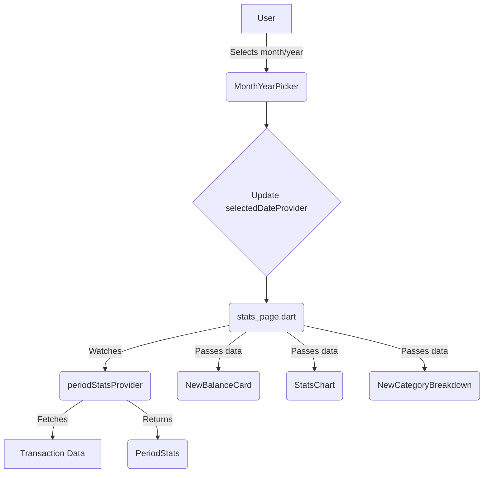

# Modification Design: Redesign of the Reports Page

## 1. Overview

This document outlines the design for the redesign of the reports page, which is currently implemented as `StatsPage`. The goal is to match the new design provided in `rapports.png` and `date_dialog.png`, creating a more modern, intuitive, and visually appealing interface for users to view their financial statistics.

The redesign includes:
- A new layout for the reports page.
- A custom month and year picker dialog.
- A chart to visualize the evolution of expenses and revenues.
- A detailed breakdown of transactions by category.

## 2. Detailed Analysis

The current `stats_page.dart` uses a `SingleChildScrollView` with a `Column` of various widgets. The state is managed by `flutter_riverpod`, with several providers fetching and processing transaction data.

The new design requires significant changes to the UI structure and the introduction of new widgets. The existing `BalanceCard` and `CategoryBreakdown` widgets will need to be replaced or heavily modified to match the new design.

The current `PeriodDropdown` will be replaced by a new month/year picker that triggers a custom dialog.

## 3. Alternatives Considered

### State Management
- **Current `flutter_riverpod`:** The existing state management solution is working well and is suitable for the new design. It allows for a clean separation of concerns and efficient data management. No change is needed.

### Charting Library
- **`fl_chart`:** A powerful and customizable charting library for Flutter. It's a good candidate for the new chart.
- **`charts_flutter`:** The official charting library from Google. It's also a good option, but `fl_chart` seems to be more popular and has a more modern API.
- **Custom Painter:** We could create the chart from scratch using `CustomPainter`, but this would be time-consuming and complex.

**Decision:** We will use the `fl_chart` library for the chart, as it offers the best balance of features, customization, and ease of use.

## 4. Detailed Design

### 4.1. New File Structure

```
lib/features/stats/presentation/
├── pages/
│   └── stats_page.dart
└── widgets/
    ├── new_balance_card.dart
    ├── new_category_breakdown.dart
    ├── month_year_picker.dart
    └── stats_chart.dart
```

### 4.2. `stats_page.dart`

This file will be the main entry point for the new reports page. It will be a `ConsumerWidget` that watches the necessary providers and builds the UI.

The main widget will be a `Scaffold` with a `CustomScrollView` and a `SliverAppBar`. This will allow for a more flexible and responsive layout.

The body of the `Scaffold` will contain the following widgets:
- `MonthYearPicker`: The new widget to select the month and year.
- `NewBalanceCard`: Two instances of this widget to display the total expenses and revenue for the selected month.
- `StatsChart`: The new widget to display the chart.
- `NewCategoryBreakdown`: The new widget to display the breakdown of transactions by category.

### 4.3. `month_year_picker.dart`

This new widget will display the currently selected month and year, with arrows to navigate to the previous and next months. When tapped, it will show the month picker dialog.

The dialog will be implemented as a `showDialog` call with a custom `AlertDialog` containing a grid of months and a year selector.

### 4.4. `new_balance_card.dart`

This widget will be a simple card that displays a title (e.g., "Dépense", "Revenue") and an amount. It will be styled to match the design in `rapports.png`.

### 4.5. `stats_chart.dart`

This widget will use the `fl_chart` library to display a line chart of expenses or revenues over the selected month. It will receive the data from the `periodStatsProvider`.

### 4.6. `new_category_breakdown.dart`

This widget will display a list of categories with their corresponding amounts and percentages. It will have a toggle to switch between expenses and revenues. The data will be provided by the `periodStatsProvider`.

### 4.7. Data Flow and State Management

The existing `periodStatsProvider` will be reused to fetch the data for the selected month. The `stats_page.dart` will watch this provider and pass the data down to the child widgets.

A new `StateProvider` will be created to manage the selected date.



## 5. Summary of the Design

The redesign of the reports page will involve creating several new widgets and modifying the existing `stats_page.dart`. The `flutter_riverpod` state management will be reused, and the `fl_chart` library will be introduced for charting. The new design will provide a more modern and user-friendly experience.

## 6. Research

- **fl_chart:** [https://pub.dev/packages/fl_chart](https://pub.dev/packages/fl_chart)
- **flutter_riverpod:** [https://pub.dev/packages/flutter_riverpod](https://pub.dev/packages/flutter_riverpod)
