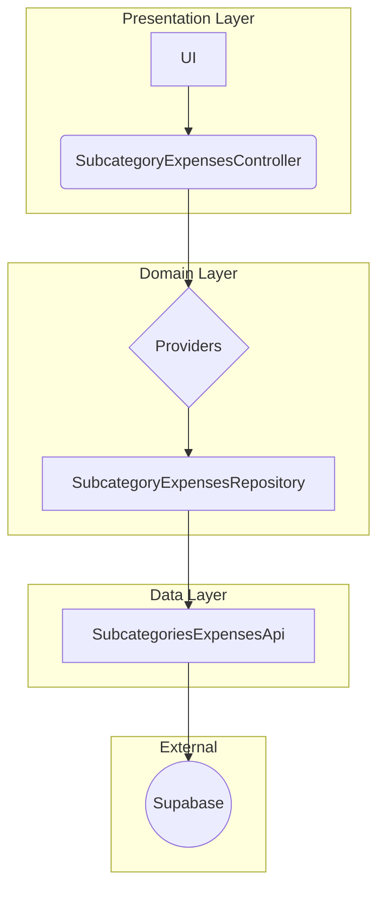

# Modification Design: Fetch Subcategory Expenses by Transaction ID

## 1. Overview

This document outlines the design for a new feature that allows fetching subcategory expenses associated with a specific transaction ID. This feature will follow the existing architectural pattern found in the `lib/features/auth` module, which is a clean architecture approach using the Repository Pattern with Riverpod for state management.

## 2. Detailed Analysis of the Goal

The goal is to create a new function that retrieves a list of `SubcategoryTransaction` objects from the `subcategory_expenses` table in Supabase. The function will take a `transaction_id` as input and return all expenses associated with that transaction.

This functionality will be encapsulated within a new vertical slice in the `lib/features/categories` feature, following the established pattern of:

-   Repository Interface
-   Repository Implementation
-   Riverpod Providers
-   Riverpod Controller

The final result will be a new Riverpod controller that can be used in the UI to get the list of subcategory expenses for a given transaction.

## 3. Alternatives Considered

No other alternatives were considered, as the user explicitly requested to follow the existing architecture of the `auth` feature. The current architecture is a solid choice for a Flutter application, providing good separation of concerns and testability.

## 4. Detailed Design

The implementation will be done in the `lib/features/categories` feature and will consist of the following new files and modifications:

### 4.1. Data Source (Modification)

-   **File:** `lib/features/categories/data/datasource/subcategories_expenses_api.dart`
-   **Content:** A new class, `SubcategoriesExpensesApi`, will be created. This class will contain a method `fetchSubcategoryExpenses(String transactionId)` that will query the `subcategory_expenses` table in Supabase and return a list of `SubcategoryTransaction` objects.

### 4.2. Repository Interface (New)

-   **File:** `lib/features/categories/domain/interfaces/subcategory_expenses_repository.dart`
-   **Content:** An abstract class, `SubcategoryExpensesRepository`, will be created. It will define the contract for the repository with a single method: `Future<List<SubcategoryTransaction>> fetchSubcategoryExpenses(String transactionId);`.

### 4.3. Repository Implementation (New)

-   **File:** `lib/features/categories/data/repository/subcategory_expenses_repository_impl.dart`
-   **Content:** A class, `SubcategoryExpensesRepositoryImpl`, will implement the `SubcategoryExpensesRepository` interface. It will take the `SubcategoriesExpensesApi` as a dependency and will call its `fetchSubcategoryExpenses` method.

### 4.4. Riverpod Providers (New)

-   **File:** `lib/features/categories/domain/providers/subcategory_expenses_providers.dart`
-   **Content:** This file will contain the Riverpod providers for this feature.
    -   A provider for the `SubcategoriesExpensesApi`.
    -   A provider for the `SubcategoryExpensesRepository`, which will provide the `SubcategoryExpensesRepositoryImpl`.
    -   A provider that takes a `transactionId` and returns the list of `SubcategoryTransaction` objects.

### 4.5. Riverpod Controller (New)

-   **File:** `lib/features/categories/presentation/controllers/subcategory_expenses_controller.dart`
-   **Content:** A Riverpod `AsyncNotifier` controller, `SubcategoryExpensesController`, will be created. This controller will use the providers to fetch the subcategory expenses and will handle the loading and error states. It will have a method to trigger the fetch operation, for example `fetch(String transactionId)`.

### 4.6. Mermaid Diagram

## 5. Summary of the Design

The proposed design introduces a new vertical slice for fetching subcategory expenses, following the established architectural pattern of the application. This ensures consistency, maintainability, and testability. The new feature will be easy to use from the UI by simply calling the new Riverpod controller.

## 6. Research URLs

-   [Riverpod Documentation](https://riverpod.dev/)
-   [Clean Architecture with Flutter and Riverpod](https://codewithandrea.com/articles/flutter-project-structure/)
-   [Supabase Dart Documentation](https://supabase.com/docs/reference/dart/introduction)
