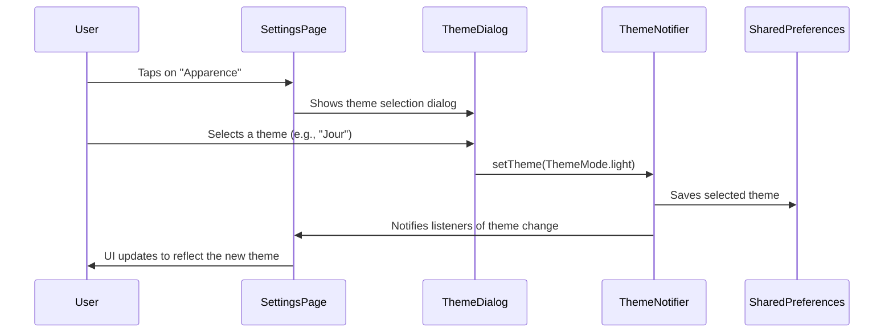

# Modification Design: Theme Selection

## Overview

This document outlines the design for implementing a theme selection feature in the Budgets app. The user will be able to choose between a light, dark, or system default theme from the settings page. The default theme of the app will be changed to light mode.

## Detailed Analysis of the Goal or Problem

The application currently has a hard-coded dark theme. The goal is to introduce a theme selection feature that allows users to switch between light, dark, and system themes. This requires the following changes:

-   Create a flexible theming system instead of hard-coded colors.
-   Implement a UI for theme selection.
-   Persist the user's theme preference.
-   Set the default theme to light mode.

## Alternatives Considered

-   **State Management:**
    -   **Riverpod:** The app already uses `flutter_riverpod`. We will use a `StateNotifierProvider` to manage the theme state. This is the recommended approach to fit into the existing architecture.
    -   **ChangeNotifier/ValueNotifier:** These are simpler state management solutions, but since the app already uses Riverpod, it's better to stick with it for consistency.

-   **Theme Persistence:**
    -   **shared_preferences:** This is a well-known and simple solution for storing key-value pairs, which is perfect for persisting the theme setting.
    -   **hive:** A more powerful and faster database, but it's overkill for storing a single theme preference.

## Detailed Design

### 1. Theme Provider

A `StateNotifierProvider` will be created to manage the theme state.

-   **`theme_provider.dart`:**
    -   A `ThemeNotifier` class will extend `StateNotifier<ThemeMode>`.
    -   It will expose methods to set the theme to light, dark, or system.
    -   It will use the `shared_preferences` package to persist the selected theme.
    -   It will load the saved theme preference on initialization.

### 2. Theme Definition

The `lib/core/theme.dart` file will be updated to define `ThemeData` for both light and dark modes.

-   **`lightTheme`:**
    -   `brightness`: `Brightness.light`
    -   `scaffoldBackgroundColor`: `#FFFFFF` (full white)
    -   `cardColor`: `#E9E9E9` (secondary white for cards and other surfaces)
    -   Text colors will be dark (e.g., `Colors.black`).
    -   Other colors will be defined to create a cohesive and visually appealing light theme, following a similar philosophy of using shades to create depth as in the dark theme.
-   **`darkTheme`:**
    -   `brightness`: `Brightness.dark`
    -   The existing dark theme color constants in `lib/core/theme.dart` will be used to construct this `ThemeData`. For example, `scaffoldBackgroundColor` will be `AppTheme.backgroundDark`.

### 3. `main.dart` Integration

The `main.dart` file will be modified to use the new theme provider.

-   The `MaterialApp` will be wrapped in a `Consumer` widget to access the theme provider.
-   The `theme`, `darkTheme`, and `themeMode` properties of the `MaterialApp` will be set based on the state of the `themeProvider`.
-   The default theme will be set to light.

### 4. Settings Page UI

The `lib/features/settings/presentation/pages/setting_page.dart` file will be modified to handle theme selection.

-   The `onTap` callback of the "Apparence" `SettingCard` will be implemented.
-   A dialog will be shown with three options: "Nuit", "Jour", and "Système".
-   When an option is selected, the corresponding method in the `ThemeNotifier` will be called.
-   The `settingChoice` text on the `SettingCard` will be updated to reflect the current theme setting.

### 5. Dependency

The `shared_preferences` package will be added to `pubspec.yaml`.

### Mermaid Diagram

## Summary of the Design

The proposed design introduces a robust and scalable theming solution using Riverpod for state management and `shared_preferences` for persistence. It fits well within the existing architecture of the app. The default theme will be light, and the user will have the option to switch to a dark theme or follow the system's theme.

## Research URLs

-   [Riverpod StateNotifierProvider](https://riverpod.dev/docs/providers/state_notifier_provider)
-   [shared_preferences package](https://pub.dev/packages/shared_preferences)
-   [Flutter ThemeData](https://api.flutter.dev/flutter/material/ThemeData-class.html)
