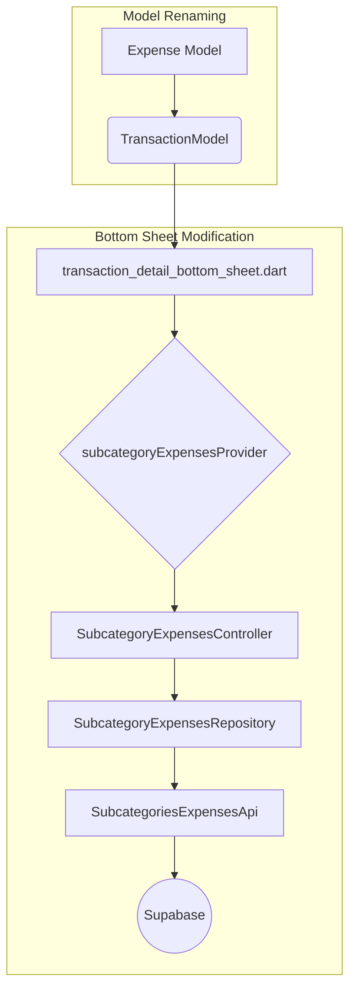

# Modification Design: Display Subcategory Transactions and Rename Expense Model

## 1. Overview

This document outlines the design for a set of changes that include:

1.  Displaying subcategory transactions in the `transaction_detail_bottom_sheet.dart`.
2.  Renaming the `Expense` model to `TransactionModel`.
3.  Adding an `id` field to the newly named `TransactionModel`.

These changes will improve the clarity of the code and add new functionality to the transaction detail view.

## 2. Detailed Analysis of the Goal

### 2.1. Rename `Expense` to `TransactionModel`

The current `Expense` model is used for both expenses and incomes, which can be confusing. Renaming it to `TransactionModel` will better reflect its purpose. This change will require updating all files that use the `Expense` model.

### 2.2. Add `id` to `TransactionModel`

The `TransactionModel` needs a unique identifier to be able to fetch related data, such as subcategory transactions. An `id` field will be added to the model. This `id` will be fetched from the `transaction` table in the database.

### 2.3. Display Subcategory Transactions

The `transaction_detail_bottom_sheet.dart` will be modified to use the `subcategoryExpensesProvider` to fetch and display the list of subcategory transactions for the selected transaction. The existing `subcategoriesProvider` will be removed from this widget.

## 3. Alternatives Considered

No other alternatives were considered, as the user's request is clear and specific. The proposed changes are logical improvements to the codebase.

## 4. Detailed Design

### 4.1. Rename `Expense` model

-   **File:** `lib/features/transactions/domain/model/expense_model.dart` will be renamed to `lib/features/transactions/domain/model/transaction_model.dart`.
-   **Content:** The `Expense` class will be renamed to `TransactionModel`.
-   **Modification:** An `id` field of type `String` will be added to the `TransactionModel`. The `fromMap`, `copyWith`, and `toMap` methods will be updated to include the new `id` field.

### 4.2. Update Usages of `Expense` model

All files that import and use the `Expense` model will be updated to import and use `TransactionModel` instead. This will be a simple find-and-replace operation in most cases.

### 4.3. Modify `transaction_detail_bottom_sheet.dart`

-   The widget will now accept a `TransactionModel` object instead of an `Expense` object.
-   The `subcategoriesProvider` will be removed.
-   The `subcategoryExpensesProvider` will be used with the `transaction.id` to fetch the list of subcategory transactions.
-   A new section will be added to the bottom sheet to display the list of subcategory transactions, similar to how the subcategories are displayed now.

### 4.4. Mermaid Diagram

## 5. Summary of the Design

The design proposes a series of related changes that will improve the data model and add new functionality. Renaming the `Expense` model will make the code more intuitive, and adding the `id` field will enable fetching related data. The modification to the bottom sheet will provide users with more detailed information about their transactions.

## 6. Research URLs

-   [Riverpod Documentation](https://riverpod.dev/)
-   [Clean Architecture with Flutter and Riverpod](https://codewithandrea.com/articles/flutter-project-structure/)
