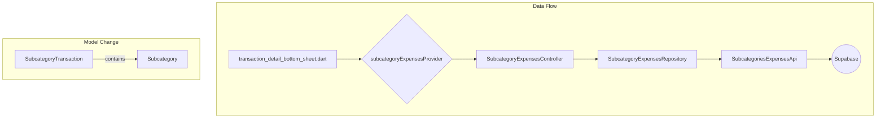

# Modification Design: Display Subcategory Name in Transaction Detail

## 1. Overview

This document outlines the design for a change to display the subcategory name instead of the subcategory ID in the transaction detail bottom sheet. This involves updating the data model, the data source, and the UI.

## 2. Detailed Analysis of the Goal

The current implementation displays the `sub_id` in the transaction detail bottom sheet, which is not user-friendly. The goal is to display the subcategory name. To achieve this, the following changes are required:

1.  The `SubcategoryTransaction` model needs to be updated to hold a `Subcategory` object instead of just the `subId`.
2.  The `subcategories_expenses_api.dart` needs to be updated to perform a join with the `subcategories` table to fetch the subcategory details along with the subcategory expense data.
3.  The `transaction_detail_bottom_sheet.dart` needs to be updated to display the name from the `Subcategory` object.

## 3. Alternatives Considered

No other alternatives were considered, as the user's request is clear and specific. The proposed changes are the correct way to implement the desired functionality.

## 4. Detailed Design

### 4.1. Update `SubcategoryTransaction` model

-   **File:** `lib/features/categories/domain/models/subcategory_transaction.dart`
-   **Content:** The `subId` field of type `String?` will be replaced with a `subcategory` field of type `Subcategory?`.
-   **Modification:** The `fromJson` method will be updated to correctly parse the joined data from Supabase. The `toJson` method will be updated to handle the `Subcategory` object.

### 4.2. Update `subcategories_expenses_api.dart`

-   **File:** `lib/features/categories/data/datasource/subcategories_expenses_api.dart`
-   **Content:** The `fetchSubcategoryExpenses` method will be updated to perform a join with the `subcategories` table.
-   **Modification:** The `select()` query will be changed to `select('*, subcategories(*)')` to fetch the subcategory details along with the subcategory expense data.

### 4.3. Modify `transaction_detail_bottom_sheet.dart`

-   **File:** `lib/features/transactions/presentation/widgets/transaction_detail_bottom_sheet.dart`
-   **Content:** The widget will be updated to display the subcategory name from the `Subcategory` object.
-   **Modification:** The `Text` widget that currently displays `sub.subId` will be changed to display `sub.subcategory?.name`.

### 4.4. Mermaid Diagram

## 5. Summary of the Design

The design proposes a straightforward and correct way to display the subcategory name in the transaction detail bottom sheet. By updating the data model and the data source, the UI can be easily updated to display the desired information.

## 6. Research URLs

-   [Supabase Dart Documentation - Joins](https://supabase.com/docs/reference/dart/select#join-foreign-tables)
